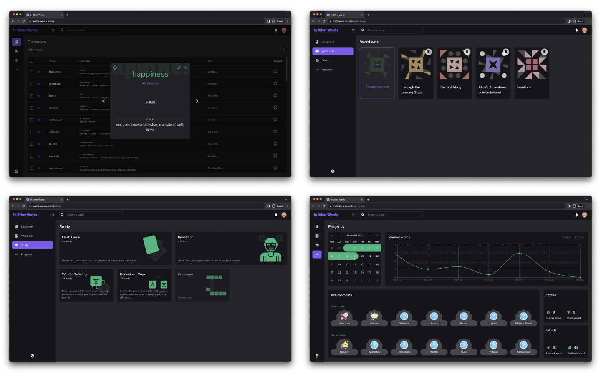

# In Other Words

Live Site URL: [In Other Words](https://inotherwords.online/)

A web application for creating a user dictionary and learning English words.

## Table of contents

- [Overview](#overview)
  - [App features](#app-features)
  - [Screenshots](#screenshots)
- [Process](#process)
  - [Built with](#built-with)
  - [Continued development](#continued-development)
  - [Resources](#resources)
- [Acknowledgments](#acknowledgments)

## Overview

### App features

Users are able to:

- Create and delete a profile.
- Add profile details like profile picture, user name, and email.
- Add words to the dictionary, edit and delete them.
- Sort and filter lists of words.
- Create sets of words, delete them, transfer words from one set to another.
- Learn words using flash cards and quizzes.
- Repeat the learned words using the spaced repetition technique.
- Track progress.

### Screenshots

## Process

### Built with

- [TypeScript](https://www.typescriptlang.org/)
- [React](https://reactjs.org/)
- [React Redux](https://react-redux.js.org/)
- [React Router](https://reactrouter.com/en/main)
- [Emotion](https://emotion.sh/docs/introduction)
- [Material UI](https://mui.com/)
- [Firebase](https://firebase.google.com/)
- [React Hook Form](https://react-hook-form.com/)
- [Yup](https://www.npmjs.com/package/yup)
- [Framer Motion](https://www.framer.com/motion/)
- [Day.js](https://day.js.org/)
- [Recharts](https://recharts.org/en-US/)
- [React Calendar](https://www.npmjs.com/package/react-calendar)
- [Vite](https://vitejs.dev/)

### Continued development

There are many ideas to improve the application. The next step is to add more word learning modes. Also integrate more APIs to extend the functionality. AI capabilities make it possible to make the application as interactive as possible, so I am also considering this option.

### Resources

- [Words API](https://www.wordsapi.com/) - Used to search for words, get definitions, transcriptions, synonyms and examples of words.
- [Merriam-Webster API](https://dictionaryapi.com/) - Merriam-Webster's Collegiate® Dictionary - used to get the audio pronunciation of the word.
